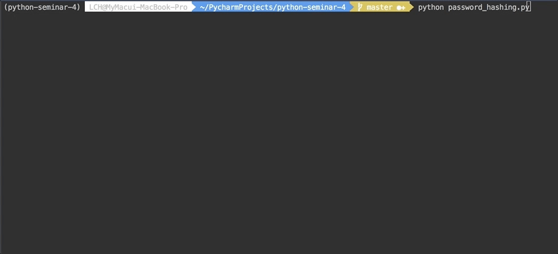
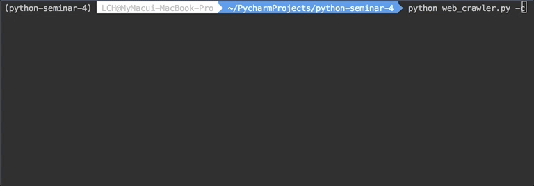

# 파이썬 4월 격월 세미나 - 동시성과 병렬성 코드
발표에서 소개한 두 가지 문제에 대한 코드입니다.

## Environments
- Python 3.6

## Install
```bash
$ pip install -r requirements.txt
```

## Password Hashing
평문 패스워드를 `bcrypt`로 해싱하기

### Run
그냥 실행하기
```bash
$ python password_hashing.py
```

멀티프로세스로 실행하기
```bash
$ python password_hashing.py -p
```

### Results
- 걸린 시간(멀티프로세스 미적용): 6.2s


- 걸린 시간(멀티프로세스 적용): 1.0s


## Web crawler
아마존에서 TV 가격 크롤링하기

### Run
그냥 실행하기
```bash
$ python web_crawler.py
```

gevent로 실행하기
```bash
$ python web_crawler.py -c
```

멀티프로세스로 실행하기
```bash
$ python web_crawler.py -p
```

### Results
- 걸린 시간(gevent 미적용): 29.2s


- 걸린 시간(gevent 적용): 4.3s
